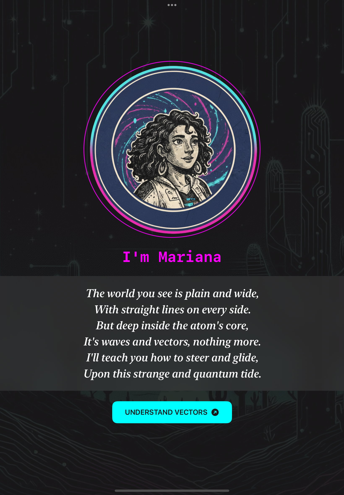
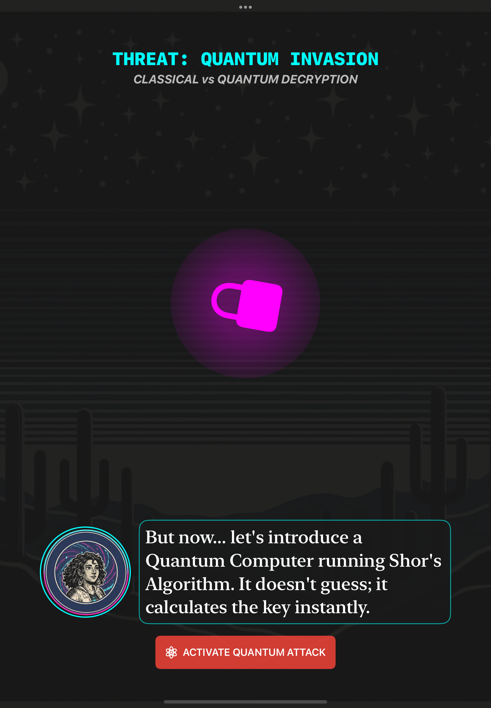
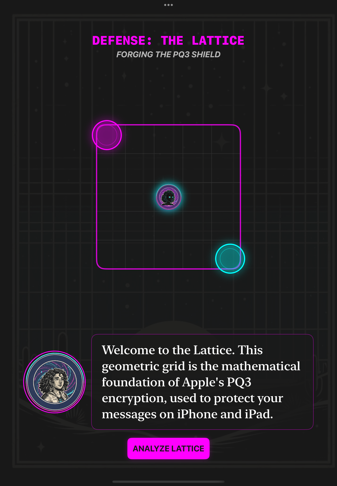

# Quantum Cordel 🌵⚛️

**Quantum Cordel** is an immersive narrative and educational experience built entirely with **SwiftUI**. The project bridges the gap between the centuries-old tradition of **Brazilian Cordel literature** and the cutting-edge world of **Post-Quantum Cryptography (PQC)**.

## 🍎 Apple Swift Student Challenge 2026
This project was developed for the **Swift Student Challenge 2026**. It showcases the power of Apple's native frameworks to humanize complex scientific concepts—like **Kyber** and **Shor's Algorithm**—through a rich, culturally rooted journey from the heart of Pernambuco, Brazil.

## 📖 The "Xilo-futurist" Narrative
Guided by **Mariana**, users explore the "Cyber-Sertão," where the threat of quantum decryption is real. The project aims to demystify the math behind **Apple's PQ3 protocol**, showing that protecting our digital future is as vital as preserving our cultural identity.

## 🎮 Core Mechanics

### 1. Quantum Threat Simulation (The Lock) 
* **Shor’s Algorithm**: Demonstrates the vulnerability of classical RSA encryption against quantum computing.
* **Visual States**: Users witness the real-time shift from a "Secure Lock" to a "Broken Lock" in a simulated quantum environment.

### 2. Kyber Lattice (Entangled Grid)
* **Quantum Correlation**: Players control Mariana (Cyan) and her Shadow (Magenta) simultaneously across a geometric grid.
* **Vector Inversion**: Moving in one axis causes the Shadow to react in the opposite direction, simulating the complexity of Lattice-based cryptography.
* **Mathematical Precision**: Built on a grid with strict boundaries to reflect the structural foundations of **PQC**.

## 🛠️ Technical Implementation

* **SwiftUI & Combine**: Used for 100% of the UI and the reactive logic behind the "intertwined" movement synchronization.
* **AVFoundation & AudioToolbox**: Orchestrates a regional soundtrack and haptic system feedback for a multisensory experience.
* **Accessibility (Universal Design)**: 
    * **VoiceOver Support**: Full semantic integration using `.accessibilityLabel`, `.accessibilityHint`, and `.accessibilityValue`.
    * **Visual Inclusivity**: High-contrast palette (Cyan/Magenta) designed for low vision and color blindness.

## 🧪 Engineering Context
This playground is inspired by my research in **Complexity Engineering** and my thesis on **Open RAN PQC Accelerators** using **Arduino MKR Vidor 4000**.

## 🚀 How to Run
1. Open the project in **Swift Playgrounds 4.6** or **Xcode 26**.
2. Ensure all assets are loaded in the `Assets.xcassets` folder.
3. Run on an **iPad simulator** for the best experience.

<table align="center">
  <tr>
    <td align="center">
       
      <b>Introduction</b>
    </td>
    <td align="center">
       
      <b>Phase 1: Concepts</b>
    </td>
    <td align="center">
       
      <b>Phase 2: PQ3 Defense</b>
    </td>
  </tr>
</table>
